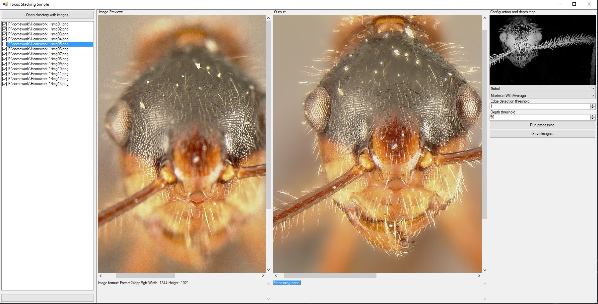

# FocusStacking
Simple and mini project done in a week after hours, a tool for focus stacking. Aside of experimenting a bit with algorithm and code, it's purpose was also to learn how one can connect C++ with C#, by using C++CLI.

Focus stacking enables to merge sorted, multiple images that has focus on different depth, to get one in focus image. 
Application is quite fast (but not optimized much) and has some parameters to play with, resulting in different quality.
It also tries to estimate a grayscale depth map, which can be then used to make 3d gif (see example below)

The bug picture was taken from http://grail.cs.washington.edu/projects/photomontage/

This is how the program looks like:

Here is 3D gif generated using output of the tool:

Below are pictures of sample results(sobel, maxWeight: 20, edge: 130).

